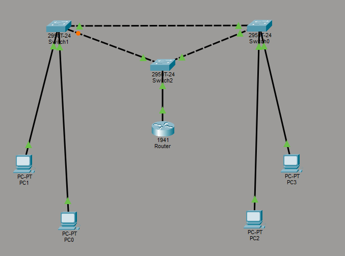
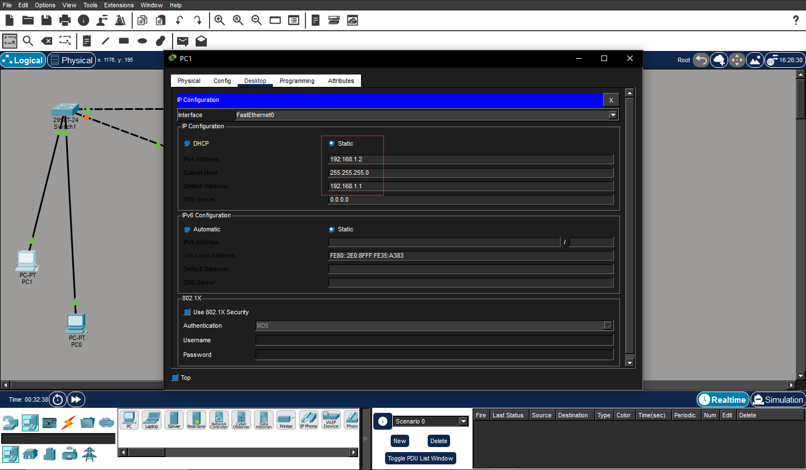
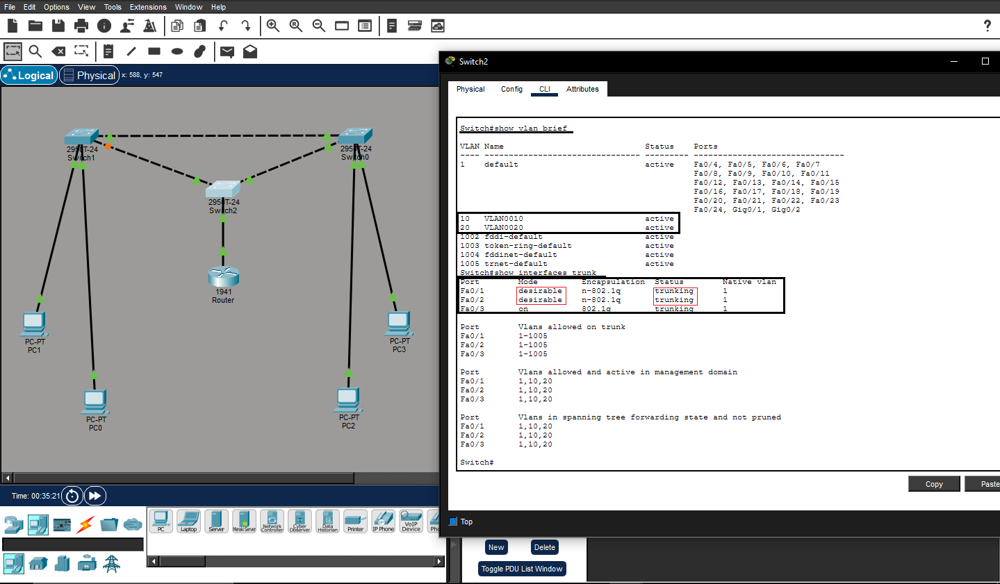
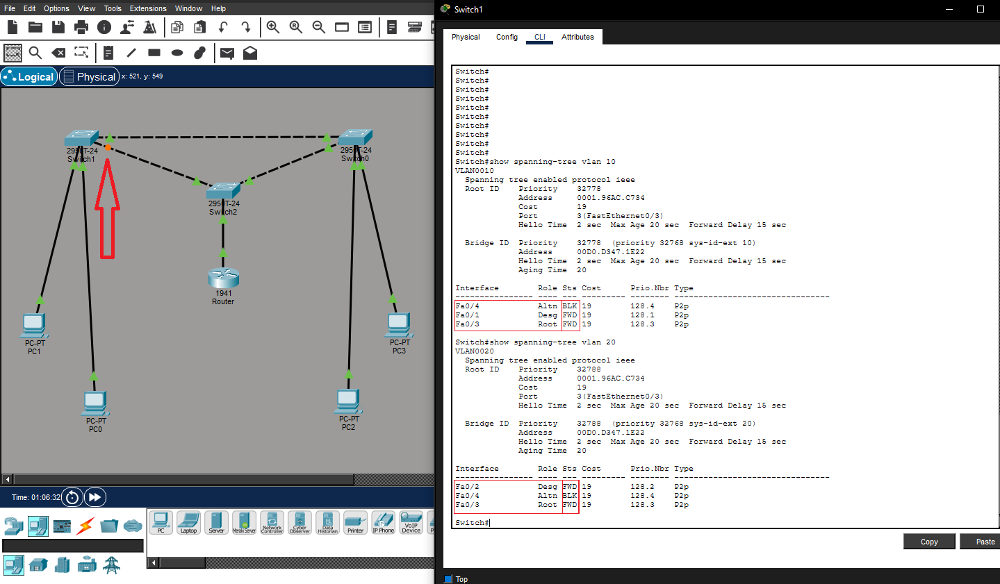
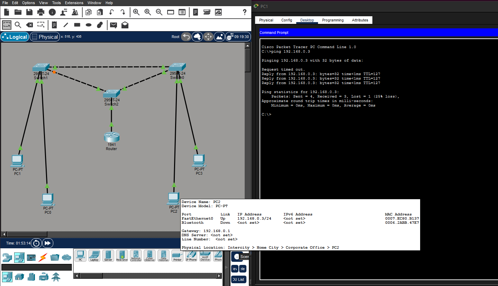
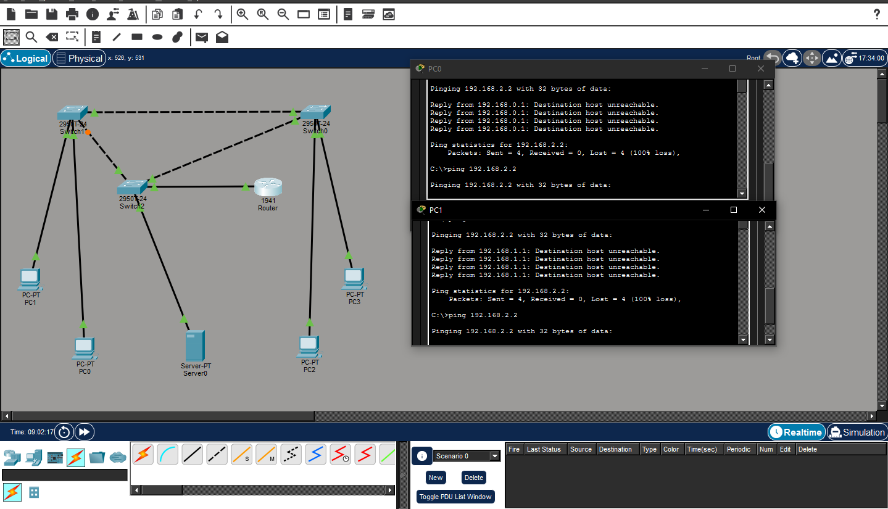

# Inter-vlan-routing

# Objective 
to configure a connection between 2 different VLANs among the computer network. Project using router-on-a-stick method.

# Tools in use
1 router (model 1941)
3 switches (model 2950T-24)
4 PCs 
straight-through and crossover internet cables.

# IP Addressing Table
| Device  | VLAN | IP Address     | Subnet Mask     | Port/Interface        | Default Gateway |
|----------|------|---------------|----------------|-----------------------|-----------------|
| PC0      | 10   | 192.168.0.2   | 255.255.255.0  | Fa0/1 - Switch0       | 192.168.0.1     |
| PC1      | 20   | 192.168.1.2   | 255.255.255.0  | Fa0/2 - Switch0       | 192.168.1.1     |
| PC2      | 10   | 192.168.0.3   | 255.255.255.0  | Fa0/1 - Switch1       | 192.168.0.1     |
| PC3      | 20   | 192.168.1.3   | 255.255.255.0  | Fa0/2 - Switch1       | 192.168.1.1     |
| Router   | 10   | 192.168.0.1   | 255.255.255.0  | G0/0.10 - Switch2     | -               |
| Router   | 20   | 192.168.1.1   | 255.255.255.0  | G0/0.20 - Switch2     | —               |
| Router   | 30   | 192.168.2.1   | 255.255.255.0  | G0/0.30 - Switch2     | -               |
| Server   | 30   | 192.168.2.2   | 255.255.255.0  | Fa0/4 - Switch2       | 192.168.2.1     |

# STEP BY STEP/PROCEDURE
First of all, we're going to assure a connection in equal VLANs
to make it more managable (each VLAN will use a different subnet to enable proper Layer 3 routing).
# FOLLOW THE IP ADDRESSING TABLE!!
# STEP 1
place the devices
straight-through cable connection between different devices (e.g. PC-SWITCH and SWITCH-ROUTER).
crossover cable connection between SWITCHES
assign manually an IP address and the default gateway corresponding to each PC.

# STEP 2 
configure VLAN 10 and 20 for each SWITCH 0 and SWITCH 1  
text: enable >> configure terminal >> VLAN 10 >> (optional) name ... >> exit          
interface fa 0/1 >> switchport mode access >> switchport access vlan 10 >>         
exit and then repeat: enable >> configure terminal >> VLAN 20 >> exit              
interface fa 0/2 >> switchport mode access >> switchport access vlan 20 

For SWITCH 2, text: enable >> configure terminal >> VLAN 10 >> exit           
repeat: VLAN 20
(although there's no need to assign interfaces to these VLANs, you still need to create it)              
exit and then make sure trunk mode is connected between SWITCH 2-ROUTER            
stil in the configure terminal, >> interface fa 0/3 >> switchport mode trunk                
Now already able to ping in equal VLANs.

After connecting the three switches, you may notice a small blocked point between them. This is STP in action. It blocks traffic on that link to prevent Layer 2 loops. If the main path goes down, the blocked link becomes active.

              
# STEP 3
now in the router we're going to configure sub-interfaces          
but first, enable the connection between router and switch to happen            
text: enable >> configure terminal >> interface g 0/0 >> no shutdown >> exit
then
text: interface g 0/0.10 >> encapsulation dot1Q 10 >> IP address 192.168.0.1 255.255.255.0 >> exit              
repeat: interface g 0/0.20 >> encapsulation dot1Q 20 >> IP address 192.168.1.1 255.255.255.0             

# TEST IT
enter PC0 prompt command >> ping 192.168.1.3
if successful, vlan should be working properly.

# V1.1.0 
# Server segmentation and Network security(ACL)

A server was added to VLAN 30 and protected using an Extended ACL.
Only VLAN 10 is allowed to access the server while other VLANs are denied.

To configure the network this way, I started by placing the server in the topology and assigning it an IP address according to the IP addressing table.
Next, I created VLAN 30 on the switch and assigned it to the port where the server is connected. Then, I configured a new subinterface on the router to enable inter-VLAN routing for this VLAN.

After confirming connectivity, an Access Control List (ACL) was implemented to restrict which VLANs could access the server, improving network security.

creating ACL and assigning it. router
enable >> configure terminal >> ip >> access-list >> extended >> 100
once inside the ACL configuration >> permit >> tcp >> 192.168.1.0 0.0.0.255 host 192.168.2.2
again
permit >> (icmp) >> 192.168.1.0 0.0.0.255 host 192.168.2.2

You may have noticed that no explicit deny rule was configured. This is because every ACL has an implicit ‘deny all’ rule at the end, which automatically blocks any traffic that is not explicitly permitted.

Now you must assign it to VLAN 30

enable >> configure terminal >> interface G 0/0.30 >> access-group >> 100 >> out

An Access Control List (ACL) is used to control which devices are allowed to communicate within the network.
In this lab, VLANs were created to simulate the segmentation of different areas of a company network. For example:

VLAN 10 – Users (e.g., Finance department)
VLAN 20 – Guests
VLAN 30 – Server network

Although the VLANs are separated, the goal of this lab is to allow inter-VLAN communication, with some restrictions. This is where the ACL is used. The objective was to allow only VLAN 10 to access the server in VLAN 30. 
To achieve this, an Extended ACL was created allowing the entire VLAN 10 subnet to reach the server using TCP and ICMP (ICMP was included t allow connectivity tests using ping).
The ACL was applied outbound on the router interface connected to VLAN 30. In this topology, all inter-VLAN traffic passes through the router, so applying the ACL OUT ensures that only traffic from VLAN 10 can reach the server.

Using an OUT ACL also simplifies the configuration. An alternative approach would be applying an IN ACL on the router subinterface connecte to VLAN 20, which would also prevent that VLAN from accessing the server. However, in a larger network with many VLANs, this approach would require attaching the same ACL to multiple subinterfaces.

By applying the ACL outbound toward the server VLAN, it is possible to block all traffic except the one explicitly permitted (VLAN 10) with a single configuration point, making the design simpler and easier to maintain.

Important ACL Concepts

Three important concepts when working with ACLs are:

1. IN vs OUT

ACLs can be applied either on the incoming or outgoing direction of an interface.

IN filters traffic as it enters the interface

OUT filters traffic before it leaves the interface

2. Standard vs Extended ACL

Standard ACL filters traffic based only on the source IP address. Because it cannot identify the destination, it is usually placed closer to the destination to avoid blocking unintended traffic.

Extended ACL allows filtering by source IP, destination IP, protocol, and ports, providing more precise control.

3. Implicit Deny

Every ACL has an implicit "deny all" rule at the end.
This means that any traffic not explicitly permitted will be automatically blocked.

